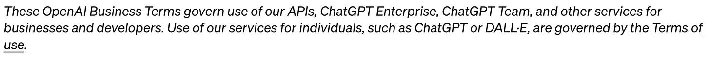
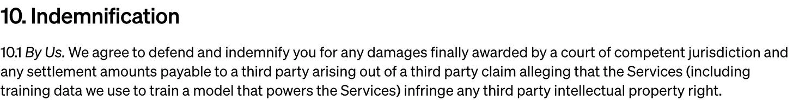
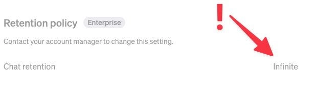
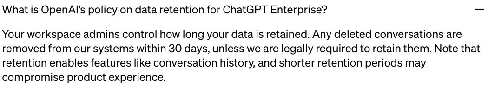
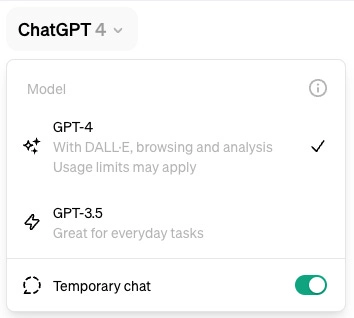
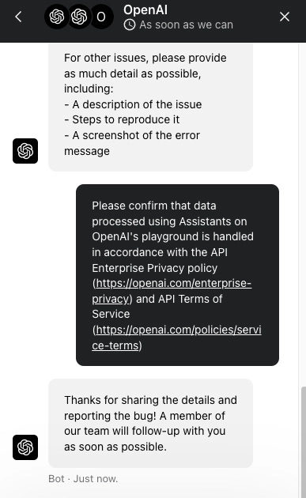
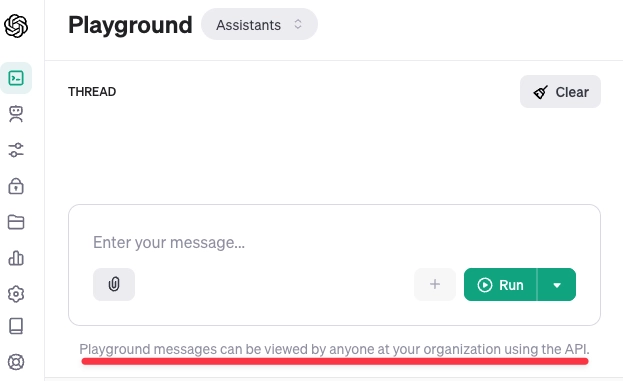

# 不想让ChatGPT永久保存你的数据?用Team版本其实有个坑

你可能听说过ChatGPT Team版本数据更安全,但实际情况是——默认设置下,你的对话记录会被"无限期"保留。听起来挺吓人的吧?最近我帮一个客户研究这个问题的时候,发现OpenAI在数据保留政策上的表述,跟实际产品设置之间存在一些微妙的差异。今天就来聊聊这个话题,看看有没有什么实用的解决方案。

---

## 模型训练:至少这点做对了

ChatGPT Team在模型训练方面做得还不错——默认关闭,而且管理员也无法打开。这比消费者版本强多了,后者默认开启训练(虽然你可以手动退出)。至少在这一点上,Team版本确实更注重隐私。

## 版权赔偿:企业级保障

**先说清楚:我不是律师,这不是法律建议。**

ChatGPT Team似乎让用户适用OpenAI的商业服务条款,其中包括"版权盾牌"——如果有第三方指控你侵犯了他们的知识产权,OpenAI会帮你辩护。这对企业用户来说是个不错的保障。

## 企业控制选项:看得到摸不着

Team版本里那些企业级控制选项全是灰色的——就算你是管理员也改不了。想要单点登录(SSO)或者调整数据保留时长?那就得升级到Enterprise版本。这就引出了最关键的问题。

## 数据保留:说出来的真相

这部分真的让我有点震惊,因为OpenAI似乎把那些"不能说的秘密"直接摆在了明面上。

他们的隐私政策里写的是标准的法律术语:

> "我们只会在提供服务所需的时间内保留您的个人信息,或者出于其他合法商业目的(如解决纠纷、安全原因或遵守法律义务)。保留时长取决于多个因素,比如信息的数量、性质和敏感度,未经授权使用或泄露的潜在风险,我们处理信息的目的,以及任何法律要求。"

这段话说得很模糊,我一直建议大家把它理解成"基本就是永久保存",虽然字面上不是这么写的。

但如果你看ChatGPT Team的聊天保留选项,它真的就直接设置成了"无限期",而且还改不了!

看起来OpenAI的市场和产品团队,跟法务部门说的不太一样。而且根据隐私政策,聊天记录确实属于"个人信息":

> "当您使用我们的服务时,我们会收集您输入、上传文件或提供反馈中包含的个人信息('内容')。"

这不是第一次我们看到OpenAI在安全问题上不同部门之间出现脱节了。我理解快速发展时难免会有些混乱,但这确实有点让人担心。

## 几个可能的解决办法

### 升级到ChatGPT Enterprise

这算不算解决办法见仁见智吧。如果你升级到Enterprise,管理员就能控制数据保留时长了。

但问题是,好几个客户跟我反映,他们连OpenAI的电话都打不通,更别说讨论购买Enterprise的事了。而且这个版本不支持自助购买。另外,从多个渠道听说,OpenAI给潜在买家的报价是每月60美元/用户,最少150个用户,合同期12个月。也就是说,一年至少要花10.8万美元——这对很多企业来说根本负担不起。

### 使用临时聊天功能

如果你担心数据保留问题,可以使用临时聊天功能,这样对话只会保留30天。但这个功能需要手动开启,没法在全公司范围内强制执行——要做到这点还是得用Enterprise版本。依赖员工手动实施安全措施,基本上就是在碰运气。

👉 [想要更灵活的数据控制?试试ChatGPT TEAM会员特价账号](https://shaoyumi.com/buy/65),让你的团队协作更安心,数据管理更可控。

*(2024年5月2日更新)OpenAI已经取消了"禁用聊天历史"功能,改成了"临时聊天"。这意味着使用时对话只保留30天,但需要手动开启,无法在组织内强制执行:*

### 手动删除敏感对话

如果你还想用自定义GPT功能,那就只能用完就手动删除对话了。OpenAI的企业隐私页面写道:

跟关闭对话历史一样,这也需要员工手动操作,所以我不会指望它能做到万无一失。

### 使用Playground

如果需要自定义GPT功能,可以考虑把它们做成Assistants(或者两种都做)。Assistants通常更安全一些,你的组织成员可以在Playground里查看和使用所有可用的Assistants。

虽然文档里没说清楚,但我问过OpenAI之后,他们确认Playground遵循OpenAI API服务条款和企业隐私条件。后者承诺最多保留30天(如果通过零数据保留[ZDR]审批,可能是0天,除非有法律保全要求)。

不过有个小问题:你组织内任何能访问API的人理论上都能看到你的对话。但经过一番研究和查看论坛讨论后,我发现这个风险其实很小,因为必须知道Thread ID才能请求其内容。

但如果你有严格的内部保密要求,这个方案可能不太合适。

另外,Playground不像用户界面那样能保存聊天历史。但这种强制删除(而不是上面几种方案的默认保留)其实更安全。

## 在AI时代平衡风险和收益

说实话,这些事情确实挺复杂的。

要不要为了使用某些功能而容忍无限期数据保留,这是个艰难的决定,最终还是要看你能承受多大的风险。

总结一下:ChatGPT Team在隐私保护上确实比消费者版本强,但"无限期"数据保留这个默认设置还是让人有点不舒服。如果你的团队对数据安全有更高要求,可以考虑上面提到的几个变通方案。当然,最理想的还是升级Enterprise,只是价格让很多人望而却步。

👉 想要更灵活地使用ChatGPT团队功能?不妨看看[ChatGPT TEAM会员特价账号](https://shaoyumi.com/buy/65),在成本和功能之间找到适合你的平衡点。数据安全和团队效率,其实可以兼得。
